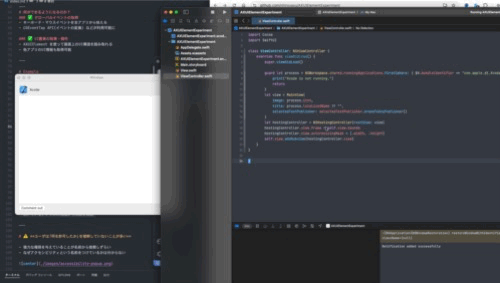

# AXUIElementExperiment

This project uses AXUIElement to continuously monitor the code selected in Xcode. It allows you to comment out the currently selected code and reflect the changes back into Xcode automatically.

## Features

- Monitors the code selection in Xcode in real time.
- Automatically comments out the selected code.
- Updates the code in Xcode with the commented selection.

## Requirements

- macOS
- Accessibility permissions enabled for the application
- Xcode

## Usage

1. Grant accessibility permissions to the application in System Preferences.
2. Run the application.
3. Select code in Xcode.
4. The selected code will be commented out and updated in Xcode automatically.

## Note

This tool uses macOS Accessibility APIs (AXUIElement) to interact with Xcode. Please ensure you have the necessary permissions enabled.

# Preview

